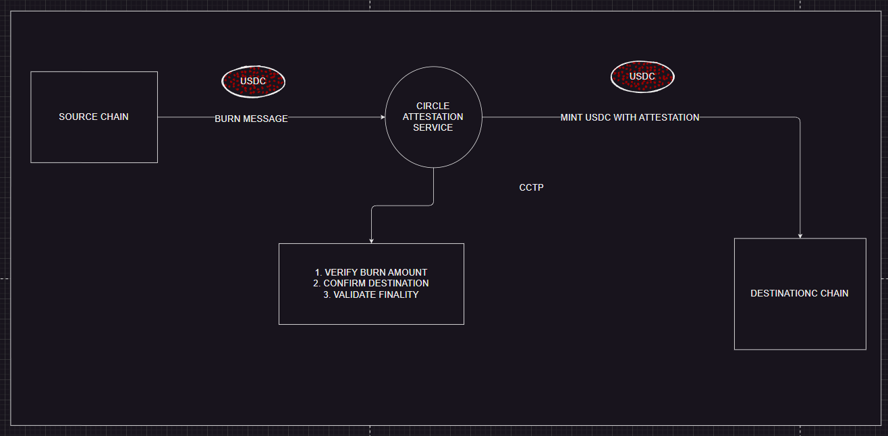

# Working principle of our Rebase Token
1. user 1 deposits some ETH into the vault contract 
2. mints the equal amount of rebase tokens
3. user 1 gets a initial interest rate of 0.05%(example) set by the owner
4. If the golbal value decreases then the owner can decrease the intrest rate (say decrease by 0.01%)
5. Now the intrest rate will be 0.04% for upcomming users and user 1 still gets 0.05% interest
6. If user2 deposits some ETH into the vault contract then user 2 will get the interest rate of 0.04%
7. Let say owner makes the interest rate 0.03% then the new users will get 0.03% interest and user 1(0.05%) and user 2(0.04%) still gets their respective interest rates

# TODO
1. A protocol that allows user to deposit ETH into a vault and in return ,recieve rebase tokens that represents their underlying balance
2. Rebase Token => The balanceOf function will be dynamic since it will be changing with time 
    - Balance increases with time
    - mint tokens to user when they perform any action(minting ,burning ,transferring or `bridging`)
3. Interest Rate => 
    - Individually sets interest rate for each user based on global intrest rate 
    - This intrest rate will be decreased over time to incentivise early users
    - The intrest rate will be calculated based on the increase in token adoption

# Contract Structure

//SPDX-License-Identifier: MIT

pragma solidity ^0.8.24;

imports

constant variables

immutable variables 

private variables

public variables

structs 

functions

    - constructor

    - modifiers

    - external functions

    - external getter functions

    - public view functions

    - public functions

    - private functions

    - internal functions

    - events

    - errors

# Building Cross Chain Rebase token with foundry and chainlink CCIP

Building a rebase token rebase token capable of operating and being transferred across multiple chains using chainlink CCIP.

## Rebase Token 

A rebase token is a type of cryptocurrency where the total supply adjusts algorithmically 
This adjustment is distributed proportionally among all token holders.
Which implies the user token balance changes not due to direct transfrs from/to the user wallet but due to the effective quantity or vaalue represented by each token unit shifts with supply

`In our specific implementation the rebase mechanism will be tied to interest rate, making user user balance to appear to grow over time as the interest accrues to the user balance`

## Cross Chain Funtionality

The core challange here is to enable the token or atlest its value representation to move from source chain to destination chain

## Chainlink CCIP

CCIP(cross chain interoperability protocol) enables the token cross chain capabilities 
It enables or provides a secure and reliable way to transfer tokens and data or messages between different blockchains

## Burn and mint mechanism

To maintain a consistent total circulating supply across all integrated chains we will use a burn and mint mechanism when tokens are transferred from source chain to destination chain

1. Tokens are burned on the source chain -- irrecoverable 
2. An equvivalent amount of tokens are minted on the destination chain
Finally the total no of tokens across all chains remains same

The rebase token will accure interest based on a straight forward linear model i.e Linear Interest
The interest earned will be a product of the user's specific interest rate and the time elapsed since their last balance update or interaction with the contract

## Local CCIP Simulation
For the purpose of local development and testing we will be using a simulated version of chainlink CCIP

### Learning Objectives
1. Chainlink CCIP
2. Enabling an existing token for cross chain functionality i.e CCIP compatibility
3. Techniques for creating custom tokens specifically designed for CCIP going beyond ERC20 standard
4. Design and implementation of rebase tokens
5. Usage of `super` keyword
6. Testing 
7. Understanding and mitigating issues related to `token dust`
8. Handling precision and truncation challanges in financial calculations
9. Implementing unit testing, fuzz testing, integration testing, fork testing
10. Usage of nested structs
11. Mechanism of bridging tokens across chains
12. Intricacies of cross chain transfers

## Development workflow

* Deployer.s.sol: This script handles the deployment of the RebaseToken, RebaseTokenPool, and Vault contracts to the target blockchain.

* ConfigurePool.s.sol: After deployment, this script is used to configure the CCIP settings on the RebaseTokenPool contracts on each chain. This includes setting parameters like supported remote chains (using their chain selectors), addresses of token contracts on other chains, and rate limits for CCIP transfers.

* BridgeTokens.s.sol: This script provides a convenient way to initiate a cross-chain token transfer, automating the calls to the RebaseTokenPool for locking/burning and CCIP message dispatch.

* Interactions.s.sol: (Implied) This script would likely contain functions for other general interactions with the deployed contracts, such as depositing into the vault or checking balances.

## Testing mechanism

* RebaseToken.t.sol:

Purpose: Contains unit and fuzz tests specifically for the RebaseToken.sol contract.

Key Test Feature: Employs assertApproxEqAbs(value1, value2, delta) for assertions. Due to the nature of interest calculations over time and potential floating-point arithmetic nuances (even when emulated with fixed-point in Solidity), rebase calculations can lead to very minor precision differences. Using assertApproxEqAbs allows us to verify that calculated values are within an acceptable tolerance (delta) of expected values, rather than insisting on exact equality (assertEq) which might lead to spurious test failures.

* CrossChain.t.sol:

Purpose: Contains fork tests designed to validate the end-to-end cross-chain functionality.

Key Test Features:

Utilizes vm.createFork("rpc_url") to create local forks of testnets like Sepolia and Arbitrum Sepolia. This allows tests to run against a snapshot of the real chain state.

Integrates CCIPLocalSimulatorFork from Chainlink Local. This powerful tool enables the simulation of CCIP message routing and execution between these local forks, effectively creating a local, two-chain (or multi-chain) test environment.

The test setup involves initializing two (or more) forked environments to represent the source and destination chains for the cross-chain operations.

## Automating deployment and cross chain operations : `bridgeToZkSync.sh`

* To streamline the entire process from deployment to a live cross-chain transfer, a bash script like bridgeToZkSync.sh is invaluable.

* Purpose: This script automates a complex sequence of operations involving contract deployments, configurations, and interactions across multiple chains (e.g., Sepolia and zkSync Sepolia).

* Steps it typically performs:

* Sets necessary permissions for the RebaseTokenPool contract, often involving CCIP-specific roles.

* Assigns CCIP roles and configures permissions for inter-chain communication.

* Deploys the core contracts (RebaseToken, RebaseTokenPool, Vault) to a source chain (e.g., Sepolia) using script/Deployer.s.sol.

* Parses the deployment output to extract the addresses of the newly deployed contracts.

* Deploys the Vault (and potentially RebaseToken and RebaseTokenPool if not already deployed as part of a unified script) on the destination chain (e.g., zkSync Sepolia).

* Configures the RebaseTokenPool on the source chain (Sepolia) using script/ConfigurePool.s.sol, linking it to the destination chain by setting remote chain selectors, token addresses on the destination chain, and CCIP rate limits.

* Simulates user interaction by depositing funds (e.g., ETH) into the Vault on Sepolia, thereby minting rebase tokens.

* Includes a pause or wait period to allow some interest to accrue on the rebase tokens.

* Configures the RebaseTokenPool on the destination chain (zkSync Sepolia), establishing the reciprocal CCIP linkage.

* Initiates a cross-chain transfer of the rebase tokens from Sepolia to zkSync Sepolia using script/BridgeTokens.s.sol.

* Performs balance checks on both chains before and after the bridge operation to verify the successful transfer and correct accounting.

### Example Use Case 
1. Deploy the `RebaseToken` ,`RebaseTokenPool` ,`Vault` contracts to a source chain (e.g., Sepolia) using script/Deployer.s.sol.
2. Cross chain deployment : Deploy the corresponding smart contracts onto a second testnet such as `ZkSync Sepolia`
3. CCIP configuration : Configure the chainlink CCIP between deployed contratcs on `sepolia` and `ZkSync Sepolia`
4. Acquire rebase tokens : Deposit ETH into the `Vault` contract on `sepolia`, therby receiving an initial balance of rebase tokens
5. Interest Accrual : Observe as the rebase token balance in the sepolia wallet increases over time, reflecting the accrure interest as per the tokens rebase mechanism
6. Cross chain transfer Execute the `BridgeTokens.s.sol` Foundry script
* Instruct the RebaseTokenPool on Sepolia to burn a specified amount of the user's rebase tokens.
* Initiate a CCIP message to the RebaseTokenPool on zkSync Sepolia.
* Upon successful CCIP message relay, the RebaseTokenPool on zkSync Sepolia will mint an equivalent amount of rebase tokens to the user's address on that chain.
7. Verification : Verify that the rebase token balance on zkSync Sepolia has increased by the expected amount.

## Type Casting for Interoperability
- When a contract instance needs to be passed as an interface type : `InterfaceType(address(contractInstance))`
- When a contract instance needs to be passed as an address type : `address(contractInstance)`
- When sending ETH via a low level call the target address must be cast to payable i.e `payable(address)`

## Testing 
forge runs tests written in solidity. Test file reside in `test/` directory and are prefixed with `test`

Forge supports the following types of testing:

1. unit testing
2. fuzz testing
3. Invariant Testing
4. Revert Testing
5. Access Control Testing
6. Event Testing
7. Gas Testing
8. Fork Testing
9. Integration Testing
10. Property based Testing

### UNIT Testing : Testing individual functions in isolation

Sample Contract 
```solidity
// SPDX-License-Identifier: MIT
pragma solidity ^0.8.24;

contract Counter {
    uint256 public number;

    function increment() public {
        number++;
    }

    function setNumber(uint256 _num) public {
        number = _num;
    }
}
```

Testfile

```solidity
// SPDX-License-Identifier: MIT
pragma solidity ^0.8.24;

import {Test} from "forge-std/Test.sol";
import {Counter} from "../src/Counter.sol";

contract CounterTest is Test {
    Counter counter;

    function setUp() public {
        counter = new Counter();
    }

    function testIncrement() public {
        counter.increment();
        assertEq(counter.number(), 1);
    }

    function testSetNumber() public {
        counter.setNumber(10);
        assertEq(counter.number(), 10);
    }
}
```

### FUZZ Testing : Automatic Random Testing (Tests function when it has parameters)

```solidity
function testFuzzSetNumber(uint256 _num) public{
    counter.setNumber(_num);
    assertEq(counter.number(), _num);
}
```

- Generates random uint256
- Runs test multiple times
- Finds edge cases

> Restricting Fuzz Inputs : `vm.assume()` filters invalid fuzz inputs
```solidity
function testFuzzSetNumber(uint256 _num) public{
    vm.assume(_num < 1e18);
    counter.setNumber(_num);
    assertEq(counter.number(), _num);
}
```

### INVARIANT Testing : Testing invariants(i.e properties which will always be true for the entire contract)

Starts with `invariant` prefix

```solidity
function invariant_NumberIsAlwaysPositive() public{
    assert(counter.number() >= 0);
}
```

This test randomly calls `setNumber` and `increment` i.e contract functions and checks the invariant after each call

### REVERT Testing : Testing if the function reverts when expected
Testing failure cases 

```solidity
function testRevert_WhenInvalid() public{
    vm.expectRevert();
    counter.setNumber(type(uint256).max+1);
}
```

This function checks if the `setNumber` function reverts when the input is greater than `type(uint256).max` 

### ACCESS CONTROL Testing : Testing access control

```solidity
address owner = makeAddr("owner");
address user = makeAddr("user");

function testOnlyOwnerCanCallFunction() public{
    vm.prank(user);
    vm.expectRevert();
    contract.onlyOwnerFunction();
}
```

### EVENT Testing : Verify emitted events

```solidity
event NumberSet(uint256 newNumber);
```

- Testfile

```solidity
function testEventNumberSet() public{
    vm.expectEmit(true,false,false,true);
    emit NumberSet(10);
    counter.setNumber(10);
}
```

### GAS Testing : Measures gas usage

```bash
forge test --gas-report
```

# Bridging : The transfer of assets cross chain 
Blockchain bridges are protocols designed to connect distinct, otherwise isolated blockchain networks.

Bridges serve as a vital connection between different blockchain ecosystems, enabling the transfer of assets and data across chains. 

## Bridge Mechanisms:
1. Burn and mint : This mechanism is often used for tokens that can be controlled by the bridge protocol on both chains.
2. Lock and Unlock : This approach is common when the bridge doesn't have minting control over the token or deals with pre-existing token supplies on the destination chain
3. Lock and Mint : This mechanism is frequently used when bridging native tokens (like ETH) or tokens that the bridge cannot burn on the source chain, to a destination chain where a representation of that asset is needed.
4. Burn and Unlock : This is essentially the reverse of the Lock-and-Mint mechanism, used when returning a wrapped asset to its native chain or redeeming it for the original.

[Visit CCIP](https://docs.chain.link/ccip)

## CCT : CCIPv1.5
We are deployign a Burn and Mint Cross chain Token b/n sepolia and arbitrum sepolia
Instead of bridging tokens, the CCT standard:

🔥 Burns tokens on source chain

📡 Sends a verified CCIP message

🪙 Mints equivalent tokens on destination chain
### Initial Setup and configuration for cct

1. Clone the repo 

```bash
git clone https://github.com/Cyfrin/ccip-cct-starter.git
```

2. Intsall dependencies

```bash
forge install
```

3. Configure the `configure.json` file
Set 
```json
withGetCCIPAdmin : false
```

4. Deploy the `DeployToken.s.sol` script on sepolia and arbitrum sepolia i.e Deploy Token contracts

```bash
forge script script/DeployToken.s.sol --rpc-url $SEPOLIA_RPC_URL --broadcast --sender <your-address> -vvvv
```

```bash
forge script script/DeployToken.s.sol --rpc-url $ARBITRUM_SEPOLIA_RPC_URL --broadcast --sender <your-address> -vvvv
```

Now deploy `DeployBurnMintTokenPool.s.sol` script on sepolia and arbitrum sepolia i.e Deploy Token Pool contracts this gets mint and burn permisions and will handle cross chain logic

```bash
forge script script/DeployBurnMintTokenPool.s.sol --rpc-url $SEPOLIA_RPC_URL --broadcast --sender <your-address> -vvvv
```

```bash
forge script script/DeployBurnMintTokenPool.s.sol --rpc-url $ARBITRUM_SEPOLIA_RPC_URL --broadcast --sender <your-address> -vvvv
```

Claiming CCIP admin role (via owner)

Since `withGetCCIPAdmin : false` in `configure.json` we need to claim CCIP admin role manually via owner method

1. Call `registerAdminViaOwner` function on `RegisteryModuleOwnerCustom` contract
2. This function allows the owner to register an address as administrator for the token in `TokenAdminRegistry` contract

on sepolia
```bash
forge script script/ClaimAdmin.s.sol --rpc-url $SEPOLIA_RPC_URL --broadcast --sender <your-address> -vvvv
```

on arbitrum sepolia
```bash
forge script script/ClaimAdmin.s.sol --rpc-url $ARBITRUM_SEPOLIA_RPC_URL --broadcast --sender <your-address> -vvvv
```

3. Accept CCIP admin role
The adddress given the role of admin now accepts the role by calling `acceptAdminRole` for the specific token

on sepolia
```bash
forge script script/AcceptAdminRole.s.sol --rpc-url $SEPOLIA_RPC_URL --broadcast --sender <your-address> -vvvv
```

on arbitrum sepolia
```bash
forge script script/AcceptAdminRole.s.sol --rpc-url $ARBITRUM_SEPOLIA_RPC_URL --broadcast --sender <your-address> -vvvv
```

4. Set Pools(link token to pools)
As the registered admint we now associate the deployed token contract address with the pool address in `TokenAdminRegistry` contract, this is done by calling `setPool` function on `TokenAdminRegistry` contract

on sepolia
```bash
forge script script/SetPool.s.sol --rpc-url $SEPOLIA_RPC_URL --broadcast --sender <your-address> -vvvv
```

on arbitrum sepolia
```bash
forge script script/SetPool.s.sol --rpc-url $ARBITRUM_SEPOLIA_RPC_URL --broadcast --sender <your-address> -vvvv
```

5. Add remote chains to pools
To enable cross chain transfers b/n our deployed pools we must register each pool with its counter part in the other chain

The `ApplyChainUpdates.s.sol` script acheives this by constructing a `TokenPool.ChainUpdate` struct

This struct contains the information about remote chain including 
    a. CCIP chain selector
    b. remote token pool address
    c. developer defined rate limmits for transfer to that remote chain

This chain is then passed to `applyChainUpdates` function on `TokenPool` contract

on sepolia
```bash
forge script script/ApplyChainUpdates.s.sol --rpc-url $SEPOLIA_RPC_URL --broadcast --sender <your-address> -vvvv
```

on arbitrum sepolia
```bash
forge script script/ApplyChainUpdates.s.sol --rpc-url $ARBITRUM_SEPOLIA_RPC_URL --broadcast --sender <your-address> -vvvv
```

> With these steps completed, your token and its associated pools are fully configured for cross-chain transfers between Sepolia and Arbitrum Sepolia.

## Executing and Verifying the bridge(Cross chain transfer)

1. Mint Tokens (Optional but necessary for testing):
If your deployer address doesn't yet have tokens on the source chain (Sepolia), mint some. The MintTokens.s.sol script calls the mint function on your deployed token contract.

```bash
forge script script/MintTokens.s.sol --rpc-url $SEPOLIA_RPC_URL --broadcast --sender <your-address> -vvvv
```

2. Transfer Tokens Cross-Chain:
Initiate a cross-chain transfer from Sepolia to Arbitrum Sepolia. The TransferTokens.s.sol script handles this. Internally, it:
* Constructs a Client.EVM2AnyMessage struct. This struct includes details like the receiver address on the destination chain, the amount of tokens to transfer, the fee token to use (LINK or native), and any extra data for programmable transfers.
* Approves the CCIP Router contract to spend the required amount of your tokens (and fee tokens, if using LINK).
* Calls the ccipSend function on the CCIP Router contract on the source chain (Sepolia).

On Sepolia (sending to an address on Arbitrum Sepolia):

```bash
forge script script/TransferTokens.s.sol --rpc-url $SEPOLIA_RPC_URL --broadcast --sender <your-address> -vvvv
```

The script will output the source transaction hash.

3. Verify the Transfer:
* Copy the source transaction hash from your terminal.
* Navigate to the Chainlink (CCIP Explorer: [https://ccip.chain.link/](https://ccip.chain.link/)).
* Paste the transaction hash into the search bar.
* The explorer will display the transaction details: Message ID, Source Transaction Hash, Status (e.g., "Waiting for finality," then "Processing," then "Success"), Source Chain, Destination Chain, From/To addresses, and the token transferred.
* Refresh the explorer page until the status shows "Success". This confirms that the tokens were burned on Sepolia and subsequently minted on Arbitrum Sepolia to the recipient address.

CCTP : Circles solution for moving USDC cross chain in a secure way : This follows burn and mint model 

## Before transfer of tokens
1. Source chain balance tokens = b
2. Destination chain balance tokens = d

## After transfer of tokens (Transfer tokens = x)
1. Source chain balance tokens = b - x
2. Destination chain balance tokens = d + x

CCTP currently has 2 methods 
1. Standard -v1 and v2 : Default method of transfer for USDC
2. Fast -v2

Standard method of transfer




